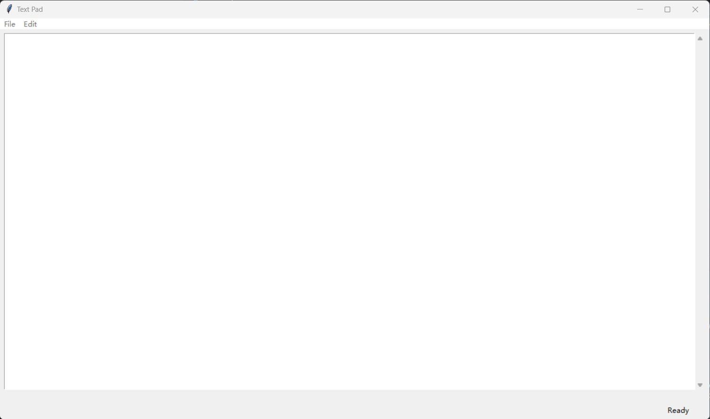
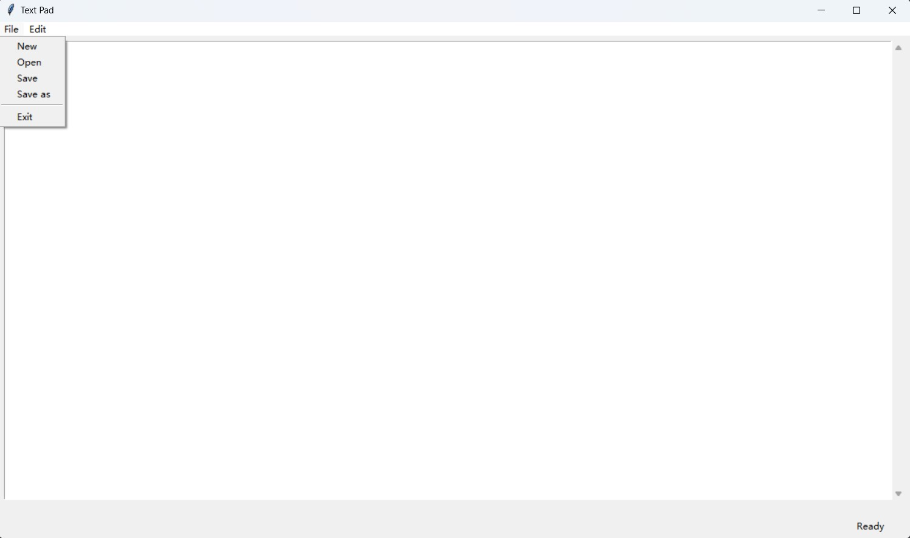

# notepad
Python Tkinter notepad

[Build A Text Editor Part 4 - Cut Copy Paste - Python Tkinter GUI Tutorial #107](https://www.youtube.com/watch?v=rUgAC_Ssflw)

# py to exe
pip install pyinstaller
pyinstaller --onefile notepad.py

# Screenshots

